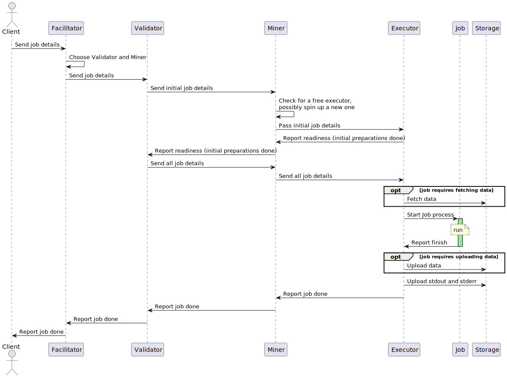

# Different Job flows

ComputeHorde distinguishes 3 job flows, serving different purposes.

## Synthetic job flow

Used primarily for assessing miner-provided hardware. In this flow, miners are given computational tasks, whose results
are previously known by validators. The nature of these tasks is that they don't require powerful computational hardware
to validate.

## Organic job flow

Used by ComputeHorde's users to perform any computational tasks. The limitation is that Miners, or rather Executors, in
this flow are black boxes, who receive a job to perform (in the form of a docker image and input volumes) and only
report back w=once they're finished (be it a success or a failure). No network communication for the time of the job
is allowed.

]

## Streaming organic job flow

Only possible with whitelisted images, this flow allows for deploying a webservice requiring a lot of computational
resources (like a LLama 70B) and querying it directly. This allows a responsive flow, in which a user waits for a spin
up once and then queries the Job back and forth multiple times for the lifetime of the Job. Accepting and replying to 
requests is the only form of network communication the Job is allowed. Additional data may be fed to the Job. Details
must be, however, passed through the Miner (not directly).

TODO: when Job finishes handling a requests and provides a signature, it should also provide timestamps. So the blob to
sign is gonna contain:

1. timestamp from
2. timestamp to
3. input hash - a strong one, like sha256
4. output hash - also sha256

input hash and output hashes are domain specific and are going to depend on the particular Job. For example, for a 
text-to-text model these might be hashes of the input/output text. For a video-to-text it might be a hash of the input 
video file and a hash of the output text, respectively.

timestamps "from" and "to" are gonna be validated by both ends, to ensure the clocks of the client and the job don't 
skew too far apart.

Validating streaming llama-70b responses will require validators to run their own 80gb vram instances, not at all times,
however. these instances can be provisioned periodically for short periods of time, when enough request-response pairs 
have been gathered. Running these jobs and priovisioning of these instaces is gonna be managed by unregistered 
ComputeHorde miners, managed by validators.